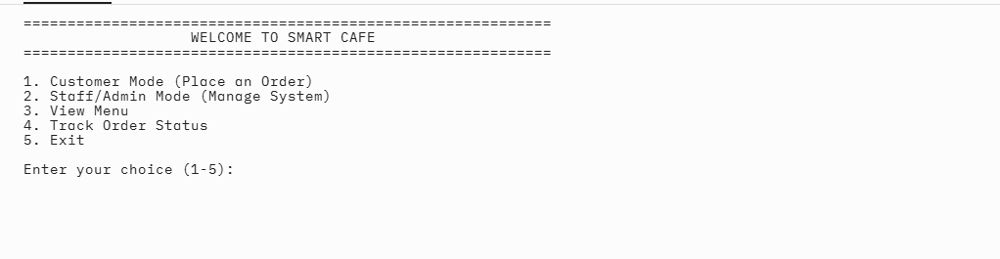
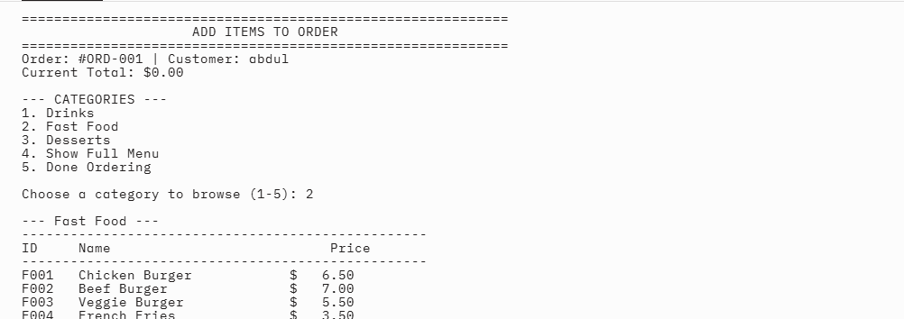
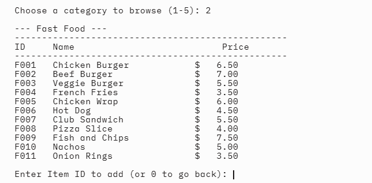
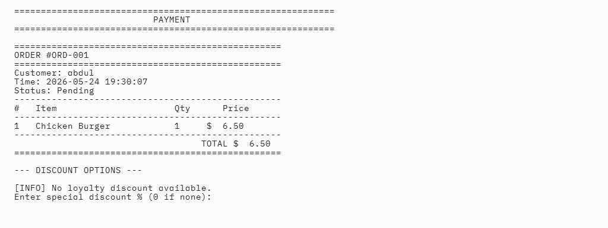
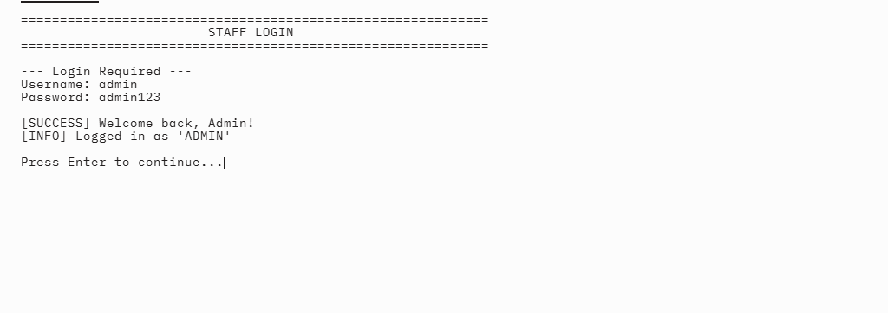
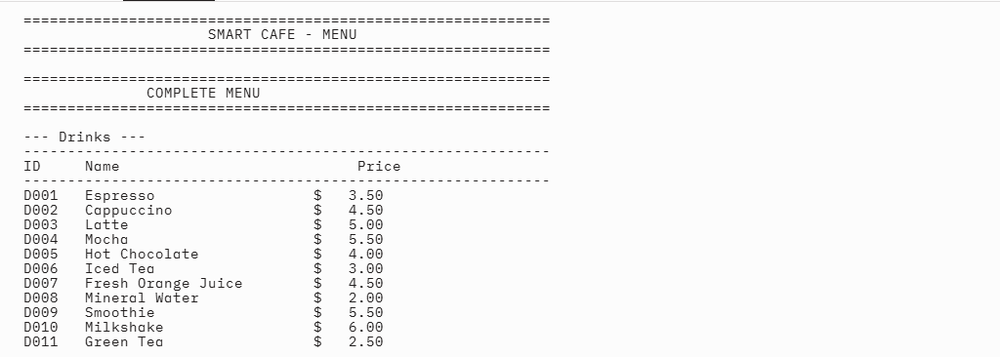

# Smart Cafe Ordering System for the lab project

A console-based Cafe Management System built with Python for university Software Engineering lab exam.

## Features of our projects

- Customer ordering with interactive menu browsing
- Staff/Admin panel with login system
- Dynamic menu management (Add, Remove, Update, Search)
- Order management with status tracking
- Billing system with discounts and tax calculation
- Loyalty points program
- File-based data persistence
- Input validation and exception handling

## Project Structure

```
smart_cafe/
├── main.py           # Entry point
├── menu_item.py      # MenuItem class
├── menu.py           # Menu CRUD & search
├── order.py          # Order management
├── person.py         # Person > Customer / Staff (inheritance)
├── billing.py        # Invoice & receipt generation
├── auth.py           # Login system
├── utils.py          # Utility functions
├── data/
│   ├── menu.txt      # Menu data
│   ├── orders.txt    # Order history
│   └── users.txt     # User credentials
└── README.md
```

## How to Run that project
Basically run the following command after cloning the git repository in the terminal 
```bash
python smart_cafe/main.py
```

## Login Credentials

| Role   | Username | Password   |
|--------|----------|------------|
| Admin  | admin    | admin123   |
| Staff  | staff1   | staff123   |

## Screenshots of running project

### 1. Welcome Screen (Main Menu)



*Main menu with options: Customer Mode, Staff Mode, View Menu, Track Order, Exit*

---

### 2. Customer Ordering - Selecting Items



*Customer browsing menu by category and adding items to order*

---

### 3. Customer Ordering - Order Summary



*Order summary showing all items, quantities, and running total before payment*

---

### 4. Bill / Receipt



*Final receipt showing items, subtotal, discount, tax, and grand total*

---

### 5. Admin Panel



*Staff/Admin panel with Menu Management, Order Management, User Management options*

---

### 6. Menu Display



*Full menu displayed by category (Drinks, Fast Food, Desserts)*

## How to Capture Screenshots of the ruuning code

1. Run the program: `python smart_cafe/main.py`
2. Take screenshots using:
   - **Windows:** `Win + Shift + S` (Snipping Tool)
   - **Mac:** `Cmd + Shift + 4`
   - **Linux:** Use GNOME Screenshot or `gnome-screenshot`
3. Save images as `screenshots/welcome.png`, `screenshots/order1.png`, etc.
4. Create the `screenshots/` folder inside `smart_cafe/`

## OOP Concepts Demonstrated

- **Classes & Objects** - MenuItem, Order, Customer, Staff, etc.
- **Inheritance** - Person > Customer, Person > Staff
- **Encapsulation** - Private attributes with getter/setter method
- **Composition** - Order contains OrderItem objects; SmartCafe contains Menu, OrderManager, AuthSystem
- **Polymorphism** - get_role() overridden in Customer and Staff
- 
- # Deployment Notes

- Run the app from the smart_cafe/ folder to ensure relative file paths resolve correctly.
- Confirm data/menu.txt, data/orders.txt, and data/users.txt exist before starting the program.
- Use a Python 3.8+ environment to avoid compatibility issues with type hints and file handling.
- 
- ## Development Tips

- Edit data/menu.txt to add or update menu items without changing code.
- Back up data/orders.txt before testing order flow to preserve sample order history.
- Extend auth.py if you want to support multiple staff or admin users with different passwords.
- 
- # Future Improvements

- Add a graphical user interface with Tkinter or a web frontend using Flask.
- Support order history search by customer name, date, or order status.
- Add role-based access control so Admin and Staff have different permission levels.
- Replace file-based storage with SQLite or JSON for more scalable data handling.
- 
- # Summary

This project is designed to demonstrate practical command-line application architecture, with clear separation between menu management, orders, billing, and authentication. It is a strong example for lab reports because it balances object-oriented design with real-world workflow features.
The project uses plain text files in data/ for persistence, making it easy to inspect and modify data without a database.
- The system validates user inputs and handles file I/O errors gracefully to prevent crashes during normal operation.
- Loyalty points are awarded for each successful order and can be used to calculate discounts on future purchases.
- 
- ## Deployment Notes

- Run the app from the `smart_cafe/` folder to ensure relative file paths resolve correctly.
- Confirm `data/menu.txt`, `data/orders.txt`, and `data/users.txt` exist before starting the program.
- Use a Python 3.8+ environment to avoid compatibility issues with type hints and file handling.
- 
- # Development Tips

- Edit `data/menu.txt` to add or update menu items without changing code.
- Back up `data/orders.txt` before testing order flow to preserve sample order history.
- Extend `auth.py` if you want to support multiple staff or admin users with different passwords.
- 
- ADVANTAGES OF THE SMART CAFE ORDERING SYSTem
Easy to run: simple python smart_cafe/main.py entry point.
Clear structure: separate modules for menu, orders, billing, auth, and utilities.
User roles: supports Admin and Staff workflows with login control.
Dynamic menu management: add, update, delete, and search menu items without code changes.
[10:56 am, 24/05/2026] u: Order tracking: manages order status and provides a summary before payment.
Billing features: calculates discounts, tax
[10:56 am, 24/05/2026] u: Billing features: calculates discounts, tax, and loyalty rewards automatically.
Persistence: stores data in plain text files, making it easy to inspect and edit.
Good learning example: demonstrates OOP concepts like inheritance, composition, and polymorphism.
Extensible: designed so UI, storage, or user management can be upgraded later

